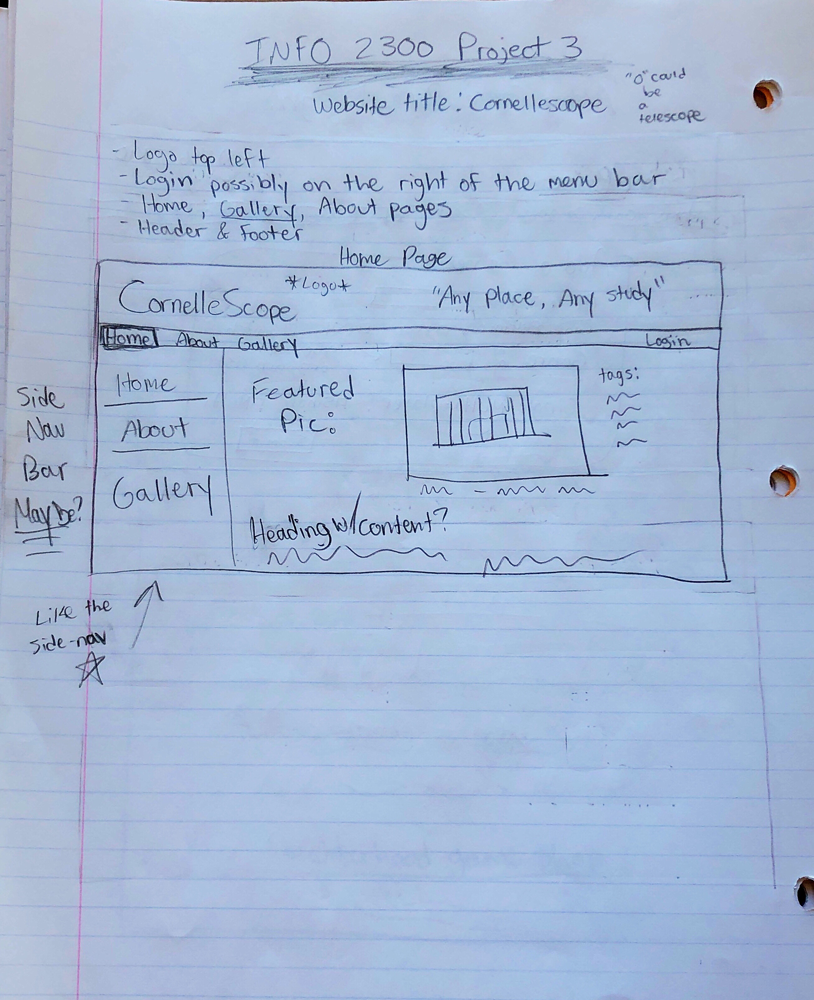
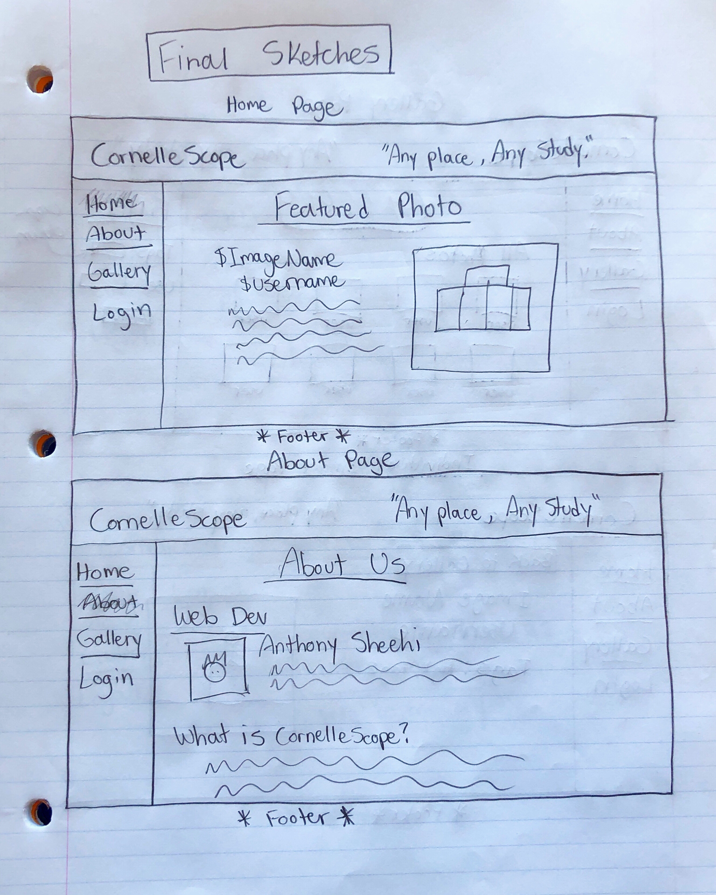
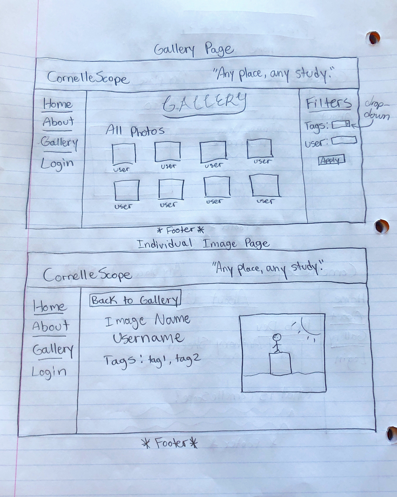
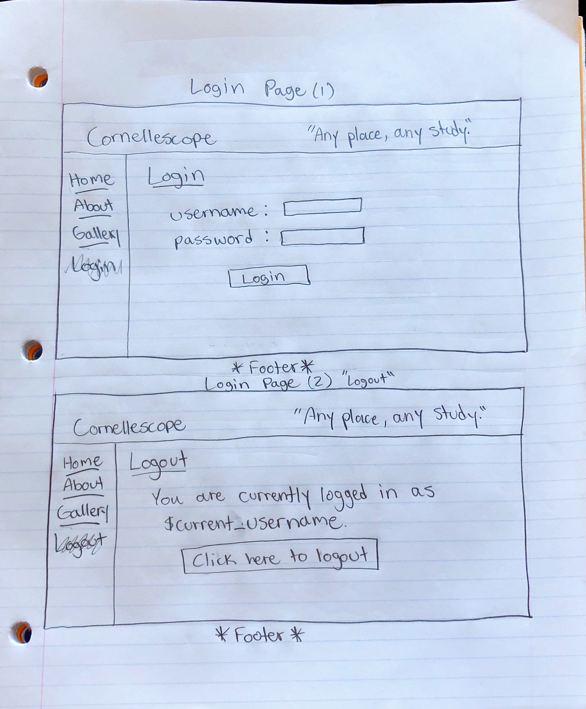

# Project 3: Design Journey

Your Name: Anthony Sheehi

**All images must be visible in Markdown Preview. No credit will be provided for images in your repository that are not properly linked in Markdown. Assume all file paths are case sensitive!**


# Project 3, Milestone 1 - Design, Plan, & Draft Website

## Describe your Gallery

[What will your gallery be about? 1 sentence.]

My gallery will be about the buildings and landmarks around Cornell's campus; it's name is CornelleScope (pronounced like 'telescope').


## Target Audiences

[Tell us about your target two audiences. ~1-3 sentences per audience]

My target audience is prospective cornellians along with current students here. By giving visual dedscriptions of buildings and landmarks around campus (and the opportunity for others to take beautiful photos of them too), I am promoting Cornell's campus, and allowing people to see the beauty in our school. Prospective students will not be able to contribute, but they will be able to view the photos taken by students here. The current students will be able to upload their own pics of the buildings to the website, where others can add tags and view the pictures.


## Design Process

[Document your design process. Show us the evolution of your design from your first idea (sketch) to design you wish to implement (sketch). Show us the process you used to organize content and plan the navigation (e.g. card sorting).]

[Label all images. All labels must be visible in Markdown Preview.]




## Final Design Plan

[Include sketches of your final design here.]






## Templates

[Identify the templates you will use on your site.]

* Header
    * Containing the website title, website header, artwork/logo, address info, etc. (everything in the top box of the design sketches)
* Navigation Bar
    * Containing links to all four web pages of the site (with a current page indicator), a side-nav bar this time!
* Footer
    * This would include social media links, address again, brief contact info for the store, maybe manager name... copyright/legal information


## Database Schema Design

[Describe the structure of your database. You may use words or a picture. A bulleted list is probably the simplest way to do this. Make sure you include constraints for each field.]

[Hint: You probably need `users`, `images`, `tags`, and `image_tags` tables.]

[Hint: For foreign keys, use the singular name of the table + _id. For example: 1) `user_id` in the `images` table or 2) `image_id` and `tag_id` for the `image_tags` table.]

```
users (
id : INTEGER {PK, U, Not, AI} -- surrogate primary key
username : TEXT {Not, U}
password : TEXT {Not}
)

images (
id : INTEGER {PK, U, Not, AI} -- surrogate primary key
name : TEXT {Not}
file_name : {Not} **Could combine file_name and ext**
ext : TEXT {Not}
description: TEXT
user_id : INTEGER {Not, U}
)

tags (
id : INTEGER {PK, U, Not, AI} -- surrogate primary key
name : TEXT {U, Not}
)

image_tags (
id : INTEGER {PK, U, Not, AI} -- surrogate primary key
tag_id : INTEGER -- foreign key
image_id : INTEGER -- foreign key
)

```


## Code Planning

[Plan what top level PHP pages you'll need.]

* index.php
* about.php
* gallery.php
* image.php


[Plan what templates you'll need.]

* head.php
* header.php
* sideNav.php (possibly? unless I can implement in header.php -> which I did!)
* footer.php


[Plan any PHP code you'll need.]

Example:
```
function is_user_logged_in() {
  if user is logged in, return true
  otherwise, return false
}

// Show logout, only if user is logged in.
if user is logged in (is_user_logged_in()) then
  show logout link
else
  show login link
end
```
```
// Show delete button if the user posted the photo
if $userID (<-- taken from the current user variable) == (SQL query) image.user_id {
  show delete button
}

if the user uploaded image (SELECT user_id from images WHERE id = 4) then
  show all tags (SELECT * from tags WHERE image_id = 4) to the user so they can delete them if they want

  if user clicks on delete link (image.php?action=delete_tag&tag_id=10&image_id=4), then
    (DELETE tag_id = 5 for image_id = 4 in image_tags table)
    (double check during filter input that current user "owns" the image before permitting deletion of tag)
  end
end


```


## Database Query Plan

[Plan your database queries. You may use natural language, pseudocode, or SQL.]

```SQL
-- Show all photos
SELECT * FROM images; -- Incporating appropriate HTML and PHP, of course

-- Get all photos belonging to the User
SELECT images.name, images.file_name, images.ext FROM images LEFT OUTER JOIN users ON user.id = images.user_id WHERE user.id = $userID;

-- Get all attributes for a singular image
SELECT images.name, images.file_name, images.ext, user.name, tags.name FROM images LEFT OUTER JOIN users, tags, image_tags ON (user.id = images.user_id) & (image_tags.image_id = images.id) & (tags.id = image_tags.tag_id) WHERE images.id = $currentImageID;

-- View all tags
SELECT tags.name FROM tags;

-- Add a tag to a photo
INSERT INTO image_tags
VALUES ($tagID, $currentImageID);
```


# Project 3, Milestone 2 - Gallery and User Access Controls

## Issues & Challenges

[Tell us about any issues or challenges you faced while trying to complete milestone 2. 2-4 sentences/bullet points]

* It took me a very long time to implement the login feature (especially on every page). The database creation and querying was fine but actually getting the site to recognize the user was a problem (error 500).
* The image links were kind of tricky to implement at first. I used lab 08 as the basis (reference) for my code and eventually got it to work though.


# Final Submission: Complete & Polished Website

## Reflection

[Take this time to reflect on what you learned during this assignment. How have you improved since starting this class? 2-4 sentences]

This assignment was by far the most challenging assignemnt I have done in any cs or info sci course. I am feeling very accomplished and I have grown so much since my first project. By the end of this assignment, I have learned how everything in my website works (like queries, sessions, login/logout, user functions, etc.) and I used good methods for debugging that I haven't in a very long time. The satisfaction you get when everything finally works the way it's supposed to is priceless.
